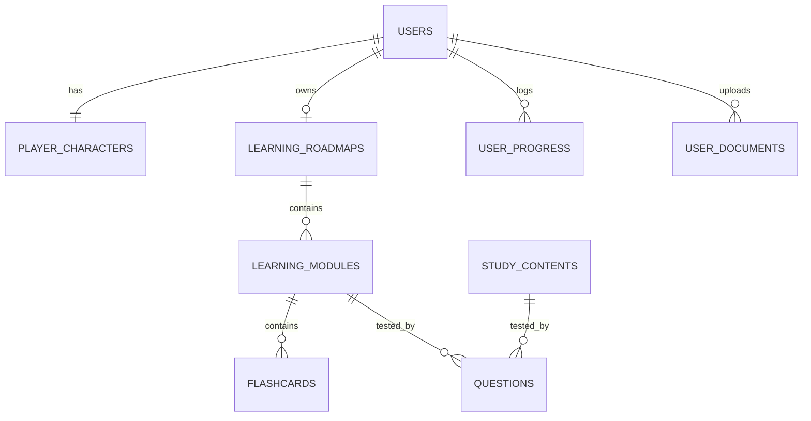

# 🏆 English Ascension - Nền tảng học tiếng Anh RPG & AI-Powered

> **Learn • Level Up • Evolve**
>
> English Ascension là nền tảng học tiếng Anh ứng dụng AI kết hợp RPG và Gamification. Người học sẽ tự thiết kế nhân vật riêng, vượt qua các màn chơi trên Bản đồ Thế giới (World Map), tăng cấp, tiến hóa nhân vật và chinh phục các mốc CEFR/TOEIC thông qua lộ trình học tập được cá nhân hóa hoàn toàn.

---

## 🗺️ Bản đồ Tính năng (Key Features)

### 1. Đăng ký & Tùy chỉnh nhân vật (Character Customization & RPG Shop)
* **Giao diện Glassmorphism hiện đại:** Màn hình đăng nhập/đăng ký đẹp mắt, trực quan và tối ưu hóa trải nghiệm trên mọi thiết bị.
* **Đăng nhập nhanh bằng Google (Google Sign-In):** Tích hợp Google Identity Services, đăng nhập nhanh qua Google Account.
* **Quên mật khẩu & Khôi phục bằng OTP Email:** Khôi phục tài khoản an toàn thông qua mã OTP 6 chữ số gửi trực tiếp qua email.
* **Tạo hình nhân vật:** Tự do tùy chọn giới tính, kiểu tóc, màu tóc, khuôn mặt, trang phục và phụ kiện.
* **Tiến hóa nhân vật (Evolution System):** Nhân vật tự động thay đổi ngoại hình, danh hiệu và hiệu ứng khi đạt các mốc cấp độ học tập:
  * *Lv 1 - 19:* **Novice** (Tập sự)
  * *Lv 20 - 39:* **Student** (Học viên)
  * *Lv 40 - 59:* **Scholar** (Học giả)
  * *Lv 60 - 79:* **Master** (Bậc thầy)
  * *Lv 80 - 99:* **Grand Sage** (Đại hiền triết)
  * *Lv 100:* **Language Legend** (Huyền thoại ngôn ngữ)
* **Cửa hàng RPG (`/shop`):** Nơi học viên sử dụng Tiền Vàng (Coins 🪙) tích lũy được từ bài học và minigame để:
  * Mua trang phục, phụ kiện độc quyền cho nhân vật.
  * Mua "Thẻ bảo toàn chuỗi" (Streak Freeze) giúp bảo vệ chuỗi ngày học liên tục.
  * Mua danh hiệu độc quyền hiển thị trên Bảng xếp hạng.

### 2. Đánh giá Đầu vào & Lộ trình Cá nhân hóa (Placement Test & AI Roadmap)
* **Placement Test:** Làm bài kiểm tra đầu vào 4 kỹ năng (Vocabulary, Grammar, Listening, Reading).
* **AI Analysis:** Phân tích điểm mạnh/yếu, CEFR Level (A1 - C2), ước lượng điểm TOEIC dự báo.
* **Lộ trình học cá nhân hóa:** AI tự động đề xuất lộ trình (Roadmap) chia theo các Module bài học phù hợp nhất với năng lực.
* **Tích hợp World Map:** Người học di chuyển qua 6 vùng đất học thuật RPG:
  `Beginner Village` $\rightarrow$ `Vocabulary Forest` $\rightarrow$ `Grammar Castle` $\rightarrow$ `Listening Mountain` $\rightarrow$ `Business City` $\rightarrow$ `TOEIC Kingdom`.

### 3. Hệ thống học tập Core (Core Learning Modules)
* **Flashcard & Spaced Repetition (Lặp lại ngắt quãng):** Học từ vựng thông minh kết hợp thuật toán lặp lại ngắt quãng để ghi nhớ tối đa.
* **Grammar & Reading Study:** Các chuyên đề ngữ pháp và bài đọc phân cấp độ, giải thích chi tiết từ AI.
* **Listening Practice:** Luyện nghe hội thoại thực tế, điền từ vào chỗ trống và trả lời câu hỏi.
* **Word Battle:** Minigame chiến đấu quái vật/boss bằng từ vựng. Trả lời đúng để tấn công, trả lời sai sẽ bị mất HP.

### 4. Tự học qua Tài liệu tải lên & AI Quiz tùy chỉnh (AI Document Learning)
* Hỗ trợ người dùng tải lên tài liệu định dạng **PDF, DOCX, TXT**.
* Hệ thống tự động trích xuất văn bản và gửi đến AI phân tích để tạo **Flashcards** và **Quiz**.
* **Quiz Tùy chỉnh:** Người học được chọn loại câu hỏi (Trắc nghiệm, Điền vào chỗ trống, hoặc Hỗn hợp) và số lượng câu mong muốn (5, 10, 15, 20 câu) trước khi làm bài.

### 5. Lớp học & Thi đấu (Classroom Feature)
* **Tạo và Tham gia Lớp học:** Người dùng có thể tạo lớp học riêng hoặc tham gia lớp học khác bằng mã code mời 6 chữ số duy nhất.
* **Quản lý Thành viên:** Giáo viên/Chủ lớp (Owner) quản lý danh sách thành viên, phê duyệt hoặc mời ra khỏi lớp.
* **Hệ thống Đề thi Lớp học (Class Quiz):** Tạo và sửa đổi đề thi của lớp (nhập tay hoặc import từ tài liệu AI).
* **Bảng xếp hạng Lớp học (Class Leaderboard):** Xếp hạng điểm số chi tiết của từng thành viên khi hoàn thành bài thi chung.

### 6. Admin Preset Roadmap Management (Quản trị Lộ trình)
* Giao diện dành riêng cho Admin (`/admin/roadmaps`) hỗ trợ thực hiện đầy đủ các thao tác CRUD (Thêm, Sửa, Xóa, Xem) đối với các Preset Roadmap (Lộ trình mẫu chuẩn CEFR/TOEIC) và các Learning Module trực tiếp trên hệ thống.
* Bảo mật chặt chẽ bằng route guard trên frontend và phân quyền `@PreAuthorize("hasRole('ADMIN')")` ở backend.

---

## 💻 Công nghệ Sử dụng (Tech Stack)

| Thành phần | Công nghệ | Chi tiết |
| :--- | :--- | :--- |
| **Frontend** | Angular 21, TailwindCSS 4, PhaserJS | Giao diện Glassmorphism, Responsive UI, minigame Phaser sống động |
| **Backend** | Spring Boot 3.5.14, Spring Security | Xử lý logic API, quản lý phiên và phân quyền bảo mật |
| **Database (Relational)** | PostgreSQL | Quản lý người dùng, tiến trình học tập, lịch sử thi đấu, lớp học |
| **Database (Graph)** | Neo4j (Tùy chọn) | Phục vụ bài toán Knowledge Graph cho các lộ trình học phức tạp |
| **Security & Auth** | JWT (JSON Web Token), Google GSI | Xác thực stateless, xác thực Google Sign-In bảo mật |
| **Email Service** | JavaMailSender | SMTP Gmail gửi mã OTP khôi phục mật khẩu |
| **AI Integration** | Groq API (Llama 3.3 70B Versatile) | Xử lý ngôn ngữ tự nhiên, phân tích tài liệu và sinh lộ trình, đề thi |
| **Document Processing** | Apache PDFBox, Apache POI | Trích xuất văn bản từ tệp tin PDF, DOCX, TXT |

---

## 🗄️ Cấu trúc Cơ sở dữ liệu Tối ưu (9 Bảng Cốt lõi)

Hệ thống được thiết kế tối ưu hóa từ 29 bảng ban đầu xuống còn **9 bảng** chính để tối đa hóa hiệu năng và khả năng bảo trì:

1. **`users`**: Thông tin tài khoản, cấp độ, EXP, Vàng, Streak.
2. **`player_characters`**: Lưu trữ ngoại hình nhân vật, trang phục, danh hiệu.
3. **`learning_roadmaps`**: Quản lý lộ trình học tập (Preset và Personal AI roadmap).
4. **`learning_modules`**: Các chủ đề học tập, module thuộc lộ trình.
5. **`flashcards`**: Từ vựng thuộc các module học hoặc từ vựng tự do.
6. **`study_contents`**: Gom toàn bộ tài nguyên Ngữ pháp, Nghe, Đọc, Đề thi (Phân biệt qua cột `type`).
7. **`questions`**: Kho câu hỏi dùng chung cho Placement Test, Quiz, Lớp học, TOEIC (Phân biệt qua cột `source_type`).
8. **`user_progress`**: Ghi nhận lịch sử và tiến trình hoàn thành tài nguyên học tập của người dùng.
9. **`user_documents`**: Tài liệu học tập cá nhân do người dùng upload.

*Sơ đồ quan hệ rút gọn:*


---

## 🗂️ Cấu trúc Thư mục (Directory Structure)

```text
english-ascension/
├── backend/                  # Mã nguồn Spring Boot (Java 17)
│   ├── src/main/java/com/englishascension/backend/
│   │   ├── feature/          # Các package tính năng (auth, classroom, document, shop, study,...)
│   │   └── security/         # Cấu hình Spring Security, JWT Filter, CORS
│   ├── src/main/resources/   # Cấu hình application.properties và dữ liệu ban đầu
│   └── pom.xml               # Quản lý thư viện Maven (chứa spring-boot-starter-mail, pdfbox, poi, v.v.)
├── frontend/                 # Mã nguồn Angular (v21) & Tailwind 8v4
│   ├── src/app/components/   # Các Component giao diện (user/ - dashboard, classroom, shop, etc. & admin/ - admin-roadmap)
│   ├── src/app/services/     # Dịch vụ giao tiếp API Backend (Auth, Classroom, Study-AI, PresetRoadmap,...)
│   ├── src/app/app.routes.ts # Định tuyến (Routing) chính của ứng dụng
│   └── package.json          # Quản lý thư viện Node.js
├── data/                     # Dữ liệu phục vụ Knowledge Graph (CSV & Neo4j scripts)
└── schema.sql                # File khởi tạo cơ sở dữ liệu PostgreSQL
```

---

## 🛠️ Hướng dẫn Cài đặt & Chạy Dự án (Installation & Quick Start)

### 📋 Yêu cầu hệ thống
* **Java Development Kit (JDK) 17** hoặc mới hơn
* **Node.js** (Khuyên dùng v20+) & **npm**
* **PostgreSQL Database Server**

---

### Bước 1: Khởi tạo Cơ sở dữ liệu PostgreSQL
1. Mở công cụ quản lý PostgreSQL (như **pgAdmin 4** hoặc terminal `psql`).
2. Tạo một cơ sở dữ liệu mới với tên: `english_ascension`.
3. Mở công cụ Query Tool của database mới tạo, sao chép toàn bộ nội dung trong file [schema.sql](file:///d:/ThucTap_VNPT/english-ascension/schema.sql) và nhấn **Execute (F5)** để tạo bảng và nạp dữ liệu mẫu ban đầu.

---

### Bước 2: Thiết lập cấu hình biến môi trường
Tạo file `.env` ở thư mục gốc của dự án hoặc chỉnh sửa cấu hình trực tiếp từ file [.env](file:///d:/ThucTap_VNPT/english-ascension/.env) chứa các thông số:
```env
# Database Configuration
SPRING_DATASOURCE_URL=jdbc:postgresql://localhost:5432/english_ascension
SPRING_DATASOURCE_USERNAME=postgres
SPRING_DATASOURCE_PASSWORD=YOUR_DB_PASSWORD

# JWT secret key
JWT_SECRET=5367566B59703373367639792F423F4528482B4D6251655468576D5A71347437

# Groq API Configuration
GROQ_API_KEY=YOUR_GROQ_API_KEY

# Google Client ID (Cho đăng nhập Google)
GOOGLE_CLIENT_ID=YOUR_GOOGLE_CLIENT_ID

# Email SMTP Config (Dành cho chức năng gửi mã OTP quên mật khẩu)
EMAIL_USER=naml75803@gmail.com
EMAIL_PASS=smasnfucxseugksy
```

*Lưu ý: Biến cấu hình email ở trên sử dụng Gmail App Password để cho phép hệ thống gửi mail bảo mật.*

---

### Bước 3: Khởi chạy Backend (Spring Boot)
1. Truy cập vào thư mục `backend/`.
2. Chạy ứng dụng bằng Maven:
   ```bash
   mvn spring-boot:run
   ```
   *Mặc định backend sẽ chạy tại: `http://localhost:8080`*

---

### Bước 4: Cài đặt và Chạy Frontend (Angular)
1. Truy cập vào thư mục `frontend/`.
2. Tiến hành cài đặt các thư viện Node.js:
   ```bash
   npm install
   ```
3. Khởi chạy server phát triển Angular:
   ```bash
   npm run dev
   ```
   (hoặc `ng serve`)
4. Truy cập giao diện ứng dụng thông qua trình duyệt tại địa chỉ: **`http://localhost:4200`**

---

### 🔑 Tài khoản thử nghiệm mặc định:
* **Học viên:**
  * **Email:** `test@gmail.com`
  * **Mật khẩu:** `123456`
* **Quản trị viên (Admin):**
  * **Email:** `admin@gmail.com`
  * **Mật khẩu:** `admin123` (hoặc tài khoản Admin tương đương được cấu hình trong `schema.sql`)