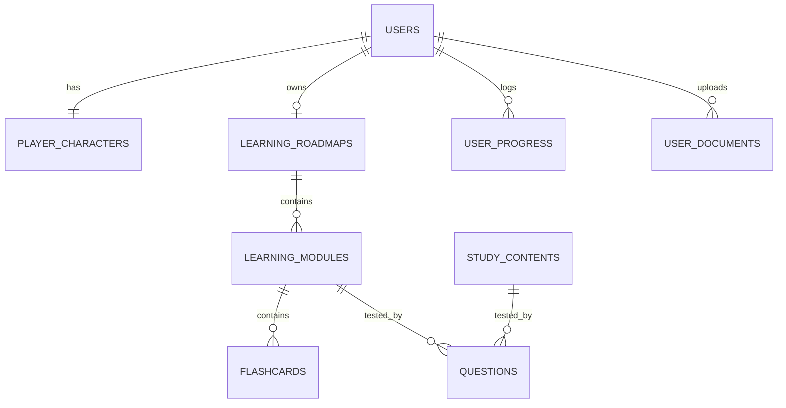

# Kế hoạch Thiết kế & Triển khai: Tối ưu hóa Cơ sở dữ liệu về 9 bảng

Tôi đề xuất cấu trúc lại toàn bộ hệ thống cơ sở dữ liệu hiện tại từ **29 bảng** (29 Model Entities) xuống còn **9 bảng** duy nhất. Sự thay đổi này giúp đơn giản hóa kiến trúc dữ liệu, tăng khả năng mở rộng, giảm thiểu trùng lặp và làm sạch tối đa mã nguồn backend.

## User Review Required

> [!IMPORTANT]
> **Tác động của việc cấu trúc lại Database**:
> - Việc gộp bảng yêu cầu chúng ta phải định nghĩa lại toàn bộ lớp Model (Entities), Repository và chỉnh sửa logic truy vấn của 5 bộ Controller chính ở backend (Grammar, Vocabulary, Listening, Reading, Exams).
> - Cấu trúc dữ liệu trong cơ sở dữ liệu PostgreSQL sẽ được làm sạch. Chúng ta sẽ cần khởi tạo lại database và seed lại dữ liệu mẫu thông qua file `schema.sql` mới.
> 
> Hãy xác nhận sự đồng ý của bạn với đề xuất thiết kế 9 bảng dưới đây trước khi tôi tiến hành sửa đổi mã nguồn.

## Bố cục Cơ sở dữ liệu hợp nhất (9 Bảng)

Chúng sa sẽ tổ chức dữ liệu thành các bảng cốt lõi sau:

### Chi tiết thiết kế các bảng:

1. **`users`** (Lưu tài khoản và tiến trình cấp độ, EXP, Vàng, Streak).
2. **`player_characters`** (Lưu nhân vật, trang phục, tóc, danh hiệu).
3. **`learning_roadmaps`** (Lộ trình AI phân tích CEFR & TOEIC).
4. **`learning_modules`** (Đóng vai trò là Module Lộ trình AI **VÀ** Chủ đề Từ vựng tự học. Chúng ta thêm cột `category` để phân biệt).
5. **`flashcards`** (Đóng vai trò là từ vựng thuộc Module AI **VÀ** Từ vựng tự học chung).
6. **`study_contents`** (Bảng tài nguyên chung: Gom toàn bộ Ngữ pháp, Nghe hiểu, Đọc hiểu, và Đề thi thử vào đây. Phân biệt bằng cột `type`: `GRAMMAR`, `LISTENING`, `READING`, `EXAM`).
7. **`questions`** (Bảng câu hỏi chung: Chứa toàn bộ câu hỏi của Placement Test, Module Quiz, Grammar Lesson, Listening Section, Reading Article, và TOEIC Exam. Phân biệt bằng cột `source_type`).
8. **`user_progress`** (Bảng lịch sử học tập chung: Ghi nhận trạng thái hoàn thành của bất kỳ tài nguyên nào như Module, Bài học tự luyện, hoặc từng Câu hỏi riêng lẻ. Thay thế hoàn toàn cho 8 bảng progress cũ).
9. **`user_documents`** (Tài liệu PDF/Text người dùng tải lên trợ lý AI).

---

## Proposed Changes

### [DELETE] Old Redundant Model files
- `Flashcard.java`, `GrammarLesson.java`, `GrammarQuestion.java`, `ListeningQuestion.java`, `ListeningSection.java`, `ListeningTopic.java`, `QuizQuestion.java`, `ReadingArticle.java`, `ReadingQuestion.java`, `ToeicExam.java`, `ToeicExamQuestion.java`.
- Các file tiến độ cũ: `UserExamProgress.java`, `UserGrammarProgress.java`, `UserListeningQuestionProgress.java`, `UserListeningSectionProgress.java`, `UserReadingArticleProgress.java`, `UserReadingQuestionProgress.java`, `UserVocabTopicProgress.java`, `UserVocabWordProgress.java`.
- Các file Từ vựng cũ: `VocabTopic.java`, `VocabWord.java`.

### [MODIFY] Core Models [NEW/REFACTORED]
- **`User.java`**: Giữ nguyên.
- **`PlayerCharacter.java`**: Giữ nguyên.
- **`LearningRoadmap.java`**: Giữ nguyên.
- **`LearningModule.java`**: Thêm trường `category` (để chứa các chủ đề tự học từ vựng).
- **`Flashcard.java`**: Được cấu hình lại để ánh xạ tới `LearningModule`.
- **`StudyContent.java`** [NEW]: Thay thế cho `GrammarLesson`, `ReadingArticle`, `ListeningSection`, `ToeicExam`.
- **`Question.java`**: Được mở rộng trường `sourceType` và `parentId` để làm bảng câu hỏi dùng chung.
- **`UserProgress.java`** [NEW]: Lưu trữ tiến độ học của tất cả tài nguyên (Module, Bài học, Câu hỏi).
- **`UserDocument.java`**: Giữ nguyên.

### [MODIFY] Repositories & Controllers
- Tạo mới các Repository tương ứng: `StudyContentRepository`, `UserProgressRepository`.
- Cập nhật lại các Controller phía backend để sử dụng cấu trúc bảng hợp nhất:
  - `GrammarStudyController.java`
  - `ListeningStudyController.java`
  - `ReadingStudyController.java`
  - `VocabularyStudyController.java`
  - `StudyController.java` (AI world map quiz)

---

## Verification Plan

### Automated Tests
- Chạy lệnh `mvn compile` để kiểm tra backend biên dịch thành công.
- Chạy lệnh `npm run build` để kiểm tra Angular biên dịch thành công (đảm bảo không ảnh hưởng đến các DTO response).

### Manual Verification
1. Xóa cơ sở dữ liệu cũ, chạy lại file `schema.sql` mới để khởi tạo 9 bảng và nạp dữ liệu seed.
2. Khởi chạy hệ thống và đăng nhập bằng tài khoản `test@gmail.com` để kiểm tra Dashboard, Lộ trình, và các kho tài nguyên tự học.
