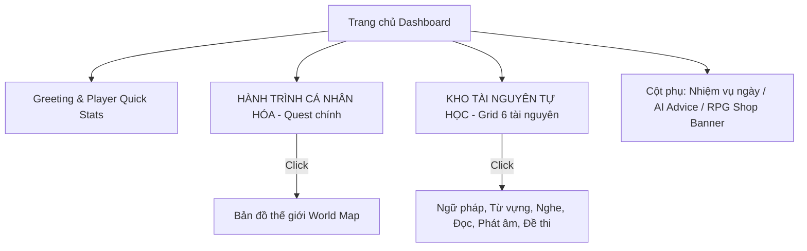

# Đề Xuất Thiết Kế: Tối Ưu Hóa Trực Quan & Sơ Đồ UX/UI Toàn Diện

Bản đề xuất cải tiến kiến trúc sản phẩm, hợp nhất các trang dư thừa, đề xuất trang mới (RPG Shop) nhằm nâng cao tính cá nhân hóa và gamification cho English Ascension.

## User Review Required

> [!IMPORTANT]
> Dưới góc độ của một Product Designer, tôi đề xuất cấu trúc lại 26 trang hiện tại thành một hệ thống tinh gọn, tập trung vào 2 trục chính: **Lộ trình cá nhân hóa AI** và **Kho tài nguyên tự luyện**.

### 1. Hợp Nhất & Loại Bỏ Các Trang Dư Thừa (UX Cleanup)
Để giảm tải việc điều hướng và tránh gây bối rối cho học viên, chúng ta sẽ thực hiện hợp nhất:

- **Hợp nhất TOEIC Vocab vào Từ Vựng chung**:
  - *Hiện tại*: Có riêng `/toeic-vocab` và `/vocabulary` làm người dùng khó chọn lựa.
  - *Giải pháp*: Xóa bỏ `/toeic-vocab`. Chuyển toàn bộ dữ liệu từ vựng TOEIC thành một danh mục/tab lựa chọn bên trong trang `/vocabulary`.
- **Hợp nhất các trang Ngữ pháp**:
  - *Hiện tại*: Có `/grammar` (danh sách bài học cũ) và `/grammar-topics` (danh sách chủ đề mới).
  - *Giải pháp*: Xóa bỏ `/grammar` (tập tin `grammar.ts` cũ). Sử dụng duy nhất `/grammar-topics` làm trang danh sách và `/grammar-study/:lessonId` làm trang học chi tiết.
- **Hợp nhất Roadmap List vào World Map**:
  - *Hiện tại*: Người dùng phải di chuyển qua lại giữa `/roadmap` (dạng danh sách) và `/world-map` (dạng bản đồ RPG).
  - *Giải pháp*: Tích hợp danh sách lộ trình thành một **Slide-out Sidebar** (hoặc tab phụ) ngay trong `/world-map`. Người dùng có thể bật/tắt danh sách bài học mà không cần chuyển trang. Khai tử tuyến đường `/roadmap`.
- **Hợp nhất Spaced Repetition vào Sổ Tay Từ Vựng (My Vocabulary)**:
  - *Hiện tại*: `/spaced-repetition` (luyện ôn tập từ vựng chuẩn IPA) và `/my-vocabulary` (sổ tay lưu từ của tôi) hoạt động độc lập.
  - *Giải pháp*: Gom tất cả vào **Học Viện Từ Vựng AI (`/my-vocabulary`)**. Sổ tay sẽ có 2 tab chính:
    1. *Từ vựng của tôi* (Danh sách các từ đã lưu kèm định nghĩa).
    2. *Ôn tập Spaced Repetition* (Luyện nhớ thông minh IPA & AI).
    Khai tử tuyến đường `/spaced-repetition`.

### 2. Thiết Kế Mới: Cửa Hàng Vật Phẩm RPG (`/shop`)
Một lỗi nghiêm trọng trong cơ chế Gamification hiện tại là: **Người học kiếm được rất nhiều tiền vàng (Coins 🪙) từ bài học và minigame, nhưng không có nơi nào để tiêu dùng.**

Tôi đề xuất xây dựng trang **Cửa hàng RPG (`/shop`)** cho phép:
- Mua trang phục, kiểu tóc, phụ kiện cho nhân vật (Avatar Customization).
- Mua "Thẻ bảo toàn chuỗi" (Streak Freeze) giúp giữ Streak ngày học nếu lỡ quên làm bài.
- Mua danh hiệu độc quyền hiển thị trên Bảng xếp hạng (Ví dụ: "Huyền thoại", "Chiến thần phản xạ").

---

## Bố Cục Trang Chủ (Dashboard) Cải Tiến

Trang chủ [dashboard.ts](file:///d:/ThucTap_VNPT/english-ascension/frontend/src/app/components/dashboard/dashboard.ts) sẽ được tổ chức lại thành **"Phòng Điều Khiển" (Control Deck)** trực quan:

### Chi Tiết UI Trang Chủ Mới:
- **Greeting Banner**: Như thiết kế ở turn trước, hiển thị level, thanh EXP, vàng, streak.
- **Khối Quest Chính (Personalized Path)**:
  - Hiển thị bản xem trước mini của Bản đồ thế giới với chương hiện tại.
  - Nút bấm to nổi bật: "BƯỚC VÀO THẾ GIỚI ASCENSION" dẫn tới `/world-map`.
- **Khối Kho Tài Nguyên Tự Học (Self-Study Hub)**:
  - Trình bày dạng các thẻ danh mục nhỏ gọn (Grammar, Vocab, Listening, Reading, Pronunciation, Exams) có thanh tiến trình % hoàn thành của từng mục.
- **RPG Shop Widget**:
  - Quảng cáo "Vật phẩm hot trong ngày" từ Cửa hàng RPG kèm nút "Mua ngay bằng Xu".

---

## Proposed Changes

### Component Merging & Route Cleanup

#### [DELETE] [grammar.ts](file:///d:/ThucTap_VNPT/english-ascension/frontend/src/app/components/grammar/grammar.ts)
#### [DELETE] [toeic-vocab.ts](file:///d:/ThucTap_VNPT/english-ascension/frontend/src/app/components/toeic-vocab/toeic-vocab.ts)
#### [DELETE] [spaced-repetition.ts](file:///d:/ThucTap_VNPT/english-ascension/frontend/src/app/components/spaced-repetition/spaced-repetition.ts)
#### [DELETE] [roadmap.ts](file:///d:/ThucTap_VNPT/english-ascension/frontend/src/app/components/roadmap/roadmap.ts)

#### [MODIFY] [app.routes.ts](file:///d:/ThucTap_VNPT/english-ascension/frontend/src/app/app.routes.ts)
- Gỡ bỏ các route `/grammar`, `/toeic-vocab`, `/spaced-repetition`, `/roadmap`.
- Thêm route mới `/shop` dẫn tới `ShopComponent`.

#### [MODIFY] [navbar.ts](file:///d:/ThucTap_VNPT/english-ascension/frontend/src/app/components/navbar/navbar.ts)
- Cập nhật các liên kết trỏ đến các đường dẫn đã được tối ưu hóa.

### Component Redesign & Creation

#### [MODIFY] [vocabulary.ts](file:///d:/ThucTap_VNPT/english-ascension/frontend/src/app/components/vocabulary/vocabulary.ts)
- Tích hợp thêm tab "Từ vựng TOEIC" để hợp nhất trang TOEIC cũ vào đây.

#### [MODIFY] [my-vocabulary.ts](file:///d:/ThucTap_VNPT/english-ascension/frontend/src/app/components/my-vocabulary/my-vocabulary.ts)
- Thêm tab "Ôn tập Spaced Repetition" để luyện phát âm và phản xạ từ vựng IPA thông minh.

#### [MODIFY] [world-map.ts](file:///d:/ThucTap_VNPT/english-ascension/frontend/src/app/components/world-map/world-map.ts)
- Xây dựng thêm Slide-out Panel bên phải hiển thị danh sách các bài học (Roadmap List) để người dùng xem trực quan.

#### [NEW] [shop.ts](file:///d:/ThucTap_VNPT/english-ascension/frontend/src/app/components/shop/shop.ts)
- Thiết kế mới trang Cửa hàng RPG hoành tráng, hiển thị các vật phẩm mua bằng Coins kèm hoạt ảnh thành công khi mua.

---

## Verification Plan

### Automated Tests
- Chạy lệnh `npm run build` để kiểm tra compile.

### Manual Verification
1. Đăng nhập ứng dụng, xem giao diện Dashboard Control Deck mới.
2. Click vào mục Lộ trình để kiểm tra Bản đồ thế giới và Slide-out Sidebar xem danh sách Module.
3. Kiểm tra trang Từ vựng để xem tab CEFR và TOEIC có hoạt động tốt cùng nhau không.
4. Mở Sổ tay từ vựng kiểm tra tab Flashcards Spaced Repetition.
5. Truy cập `/shop` qua menu hoặc link quảng cáo để mua thử một vật phẩm, xem vàng có bị trừ tương ứng và hiển thị hiệu ứng mua thành công không.
