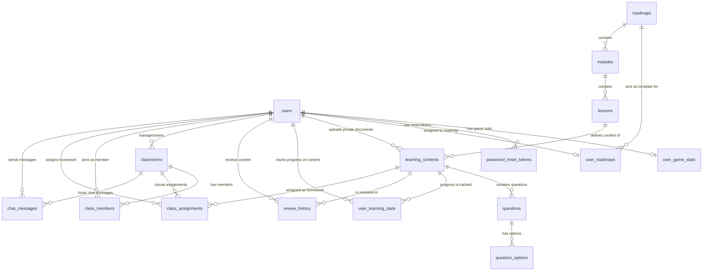

# Đề Xuất Tối Ưu Hóa & Rút Gọn Database (SOLID Design) - Bản Đơn Giản Hóa

Bản đề xuất này đã được tinh giản sâu theo yêu cầu của bạn: **Loại bỏ hoàn toàn tính năng tạo nhân vật và tiền xu (coins)**, giữ lại chỉ số **EXP, Level, Streak** và bổ sung thêm thuộc tính **Avatar** trực tiếp vào bảng người dùng (`users`).

---

## 1. Bản Đồ Ánh Xạ (Mapping) Từ Schema Cũ Sang Schema Mới

| Phân Hệ Cũ (30 bảng) | Bảng Mới Đề Xuất (16 bảng) | Cơ Chế Thu Gọn & Giải Thích |
| :--- | :--- | :--- |
| **USER DOMAIN** | | |
| `users` (auth) | **`users`** | Định danh & Xác thực. Bổ sung trường `avatar` để hiển thị ảnh đại diện người dùng. |
| `users` (reset token) | **`password_reset_tokens`** | Tách cơ chế đặt lại mật khẩu ra khỏi bảng User chính (SRP). |
| `users` (exp, level, streak, coins, character) | **`user_game_stats`** | **[TINH GIẢN]** Loại bỏ toàn bộ các thuộc tính tùy biến nhân vật và coins. Chỉ giữ lại 3 chỉ số học tập cốt lõi: `streak`, `exp`, và `level`. |
| **LEARNING DOMAIN** | | |
| `learning_roadmaps` | **`roadmaps`** | Lưu trữ khuôn mẫu lộ trình học chuẩn (Template). |
| `user_learning_paths` + `user_placement_results` | **`user_roadmaps`** | Lưu lộ trình thực tế của từng User, tích hợp kết quả Placement Test (`placement_score`, `recommended_level`). |
| `learning_modules` | **`modules`** | Các phần học lớn trong lộ trình. |
| `lessons` + `user_learning_path_lessons` | **`lessons`** | Các bài học nhỏ. Loại bỏ bảng phụ nhiều-nhiều bằng cách đưa thông tin tiến trình về Progress Domain. |
| `grammar_lessons`, `listening_topics`, `reading_articles`, `vocabulary_words`, `user_documents` | **`learning_contents`** | Gom toàn bộ nội dung lý thuyết/tài liệu tự học về 1 bảng duy nhất bằng cơ chế Polymorphic (phân biệt qua cột `type` như `GRAMMAR`, `LISTENING`, `READING`, `VOCABULARY`, `USER_DOCUMENT`). |
| **ASSESSMENT DOMAIN** | | |
| `questions`, `grammar_questions`, `listening_questions`, `reading_questions`, `placement_test_questions`, `roadmap_quiz_questions`, `user_document_questions` | **`questions`** | Gom toàn bộ câu hỏi của các phân hệ về 1 bảng `questions` duy nhất liên kết với bảng `learning_contents` qua khóa ngoại `content_id`. |
| Các cột `option_a/b/c/d` trong tất cả các bảng câu hỏi cũ | **`question_options`** | Tách các tùy chọn đáp án ra thành bảng riêng để hỗ trợ câu hỏi có số lượng đáp án linh hoạt. |
| **PROGRESS DOMAIN** | | |
| `user_progress`, `user_grammar_progress`, `user_listening_progress`, `user_reading_progress` | **`user_learning_state`** | Một bảng duy nhất quản lý trạng thái học tập của User trên bất kỳ tài nguyên nào (`content_id`), lưu điểm số và đáp án dạng JSON. |
| `flashcards` (spaced repetition) | **`review_history`** | Chỉ lưu vết lịch sử ôn tập và các thông số thuật toán SuperMemo (`e_factor`, `interval`, `repetitions`, `next_review_date`). |
| **CLASSROOM & COMMUNITY DOMAIN** | | |
| `classrooms` | **`classrooms`** | Thông tin lớp học (tên, mã mời, chủ phòng). |
| `class_members` | **`class_members`** | Thành viên trong lớp (Học sinh/Giáo viên). |
| `class_quizzes` | **`class_assignments`** | Bài tập về nhà được giáo viên giao, trỏ liên kết đến bài học/bài kiểm tra nằm trong `learning_contents`. |
| `chat_messages` | **`chat_messages`** | Tin nhắn trao đổi. Hỗ trợ cả kênh chat chung hệ thống lẫn phòng chat riêng của từng lớp học. |

---

## 2. Thiết Kế Chi Tiết Thuộc Tính 16 Bảng Mới (Bản Tinh Giản)

### 2.1 USER DOMAIN

#### Bảng `users`
Lưu trữ thông tin tài khoản cốt lõi và ảnh đại diện (avatar) của người dùng.

```sql
CREATE TABLE users (
    id BIGSERIAL PRIMARY KEY,
    email VARCHAR(255) UNIQUE NOT NULL,
    password VARCHAR(255) NOT NULL,
    role VARCHAR(50) NOT NULL DEFAULT 'ROLE_USER',
    active BOOLEAN NOT NULL DEFAULT TRUE,
    avatar VARCHAR(500), -- Thêm trực tiếp Avatar tại đây (link ảnh đại diện)
    created_at TIMESTAMP NOT NULL DEFAULT CURRENT_TIMESTAMP,
    updated_at TIMESTAMP DEFAULT CURRENT_TIMESTAMP
);
```

#### Bảng `password_reset_tokens`
```sql
CREATE TABLE password_reset_tokens (
    id BIGSERIAL PRIMARY KEY,
    user_id BIGINT NOT NULL REFERENCES users(id) ON DELETE CASCADE,
    token VARCHAR(255) UNIQUE NOT NULL,
    expiry_date TIMESTAMP NOT NULL
);
```

#### Bảng `user_game_stats`
Lưu trữ các số liệu đo lường học tập cốt lõi của người dùng. Không còn các trường nhân vật ảo hay tiền xu (coins).

```sql
CREATE TABLE user_game_stats (
    user_id BIGINT PRIMARY KEY REFERENCES users(id) ON DELETE CASCADE,
    streak INT NOT NULL DEFAULT 0,
    exp INT NOT NULL DEFAULT 0,
    level INT NOT NULL DEFAULT 1
);
```

---

### 2.2 LEARNING DOMAIN

#### Bảng `roadmaps`
```sql
CREATE TABLE roadmaps (
    id BIGSERIAL PRIMARY KEY,
    cefr_level VARCHAR(50) NOT NULL,
    toeic_equivalent VARCHAR(100),
    overall_evaluation TEXT,
    thumbnail_emoji VARCHAR(50),
    difficulty_label VARCHAR(50),
    is_preset BOOLEAN NOT NULL DEFAULT TRUE
);
```

#### Bảng `user_roadmaps`
```sql
CREATE TABLE user_roadmaps (
    id BIGSERIAL PRIMARY KEY,
    user_id BIGINT UNIQUE NOT NULL REFERENCES users(id) ON DELETE CASCADE,
    roadmap_id BIGINT REFERENCES roadmaps(id) ON DELETE SET NULL,
    
    -- Tích hợp điểm kiểm tra đầu vào (Placement Test)
    placement_score INT,
    recommended_level VARCHAR(50),
    tested_at TIMESTAMP,
    
    created_at TIMESTAMP NOT NULL DEFAULT CURRENT_TIMESTAMP
);
```

#### Bảng `modules`
```sql
CREATE TABLE modules (
    id BIGSERIAL PRIMARY KEY,
    roadmap_id BIGINT REFERENCES roadmaps(id) ON DELETE CASCADE,
    title VARCHAR(255) NOT NULL,
    description TEXT,
    order_index INT NOT NULL
);
```

#### Bảng `lessons`
```sql
CREATE TABLE lessons (
    id BIGSERIAL PRIMARY KEY,
    module_id BIGINT REFERENCES modules(id) ON DELETE CASCADE,
    title VARCHAR(255) NOT NULL,
    order_index INT NOT NULL,
    lesson_type VARCHAR(50) NOT NULL -- VOCABULARY, GRAMMAR, LISTENING, READING
);
```

#### Bảng `learning_contents`
```sql
CREATE TABLE learning_contents (
    id BIGSERIAL PRIMARY KEY,
    lesson_id BIGINT REFERENCES lessons(id) ON DELETE CASCADE, -- Kết nối đến bài học chính quy
    user_id BIGINT REFERENCES users(id) ON DELETE SET NULL, -- Nullable (Dành cho tài liệu tự tải lên của user)
    
    content_type VARCHAR(50) NOT NULL, -- GRAMMAR, LISTENING, READING, VOCABULARY, USER_DOCUMENT
    title VARCHAR(255) NOT NULL,
    category VARCHAR(100),
    body_text TEXT,                    -- Chứa lý thuyết / bài đọc / văn bản tài liệu trích xuất
    media_url TEXT,                     -- Link file âm thanh (Listening) hoặc hình ảnh
    duration_seconds INT,
    
    -- Siêu dữ liệu từ vựng (chỉ dùng khi content_type = 'VOCABULARY')
    vocab_word VARCHAR(255),
    vocab_part_of_speech VARCHAR(50),
    vocab_phonetic VARCHAR(100),
    vocab_example_sentence TEXT,
    vocab_example_translation TEXT,
    
    created_at TIMESTAMP NOT NULL DEFAULT CURRENT_TIMESTAMP
);
```

---

### 2.3 ASSESSMENT DOMAIN

#### Bảng `questions`
```sql
CREATE TABLE questions (
    id BIGSERIAL PRIMARY KEY,
    content_id BIGINT REFERENCES learning_contents(id) ON DELETE CASCADE, -- Liên kết trực tiếp tới bài học hoặc tài liệu AI
    question_text TEXT NOT NULL,
    audio_url VARCHAR(555),
    image_url VARCHAR(555),
    explanation TEXT,
    difficulty VARCHAR(50)
);
```

#### Bảng `question_options`
```sql
CREATE TABLE question_options (
    id BIGSERIAL PRIMARY KEY,
    question_id BIGINT NOT NULL REFERENCES questions(id) ON DELETE CASCADE,
    option_key VARCHAR(50) NOT NULL, -- A, B, C, D... hoặc Text nối từ
    option_value TEXT NOT NULL,      -- Nội dung đáp án
    is_correct BOOLEAN NOT NULL DEFAULT FALSE
);
```

---

### 2.4 PROGRESS DOMAIN

#### Bảng `user_learning_state`
```sql
CREATE TABLE user_learning_state (
    id BIGSERIAL PRIMARY KEY,
    user_id BIGINT NOT NULL REFERENCES users(id) ON DELETE CASCADE,
    content_id BIGINT NOT NULL REFERENCES learning_contents(id) ON DELETE CASCADE,
    
    status VARCHAR(50) NOT NULL DEFAULT 'UNLOCKED', -- LOCKED, UNLOCKED, IN_PROGRESS, COMPLETED
    score INT,
    answers_json TEXT, -- Nhật ký đáp án
    completed_at TIMESTAMP,
    updated_at TIMESTAMP DEFAULT CURRENT_TIMESTAMP
);
```

#### Bảng `review_history`
```sql
CREATE TABLE review_history (
    id BIGSERIAL PRIMARY KEY,
    user_id BIGINT NOT NULL REFERENCES users(id) ON DELETE CASCADE,
    content_id BIGINT NOT NULL REFERENCES learning_contents(id) ON DELETE CASCADE, -- Trỏ tới từ vựng/bài học cần ôn tập
    
    -- Thuật toán Spaced Repetition (SuperMemo-2)
    e_factor DOUBLE PRECISION DEFAULT 2.5,
    repetition_interval INT DEFAULT 1,
    repetitions INT DEFAULT 0,
    next_review_date TIMESTAMP NOT NULL,
    last_reviewed_at TIMESTAMP
);
```

---

### 2.5 CLASSROOM & COMMUNITY DOMAIN

#### Bảng `classrooms`
```sql
CREATE TABLE classrooms (
    id BIGSERIAL PRIMARY KEY,
    name VARCHAR(150) NOT NULL,
    description TEXT,
    invite_code VARCHAR(10) UNIQUE NOT NULL,
    created_by BIGINT NOT NULL REFERENCES users(id) ON DELETE CASCADE,
    created_at TIMESTAMP NOT NULL DEFAULT CURRENT_TIMESTAMP,
    updated_at TIMESTAMP DEFAULT CURRENT_TIMESTAMP
);
```

#### Bảng `class_members`
```sql
CREATE TABLE class_members (
    id BIGSERIAL PRIMARY KEY,
    classroom_id BIGINT NOT NULL REFERENCES classrooms(id) ON DELETE CASCADE,
    user_id BIGINT NOT NULL REFERENCES users(id) ON DELETE CASCADE,
    role VARCHAR(20) NOT NULL DEFAULT 'MEMBER', -- OWNER, MEMBER
    joined_at TIMESTAMP NOT NULL DEFAULT CURRENT_TIMESTAMP,
    CONSTRAINT uq_new_classroom_user UNIQUE (classroom_id, user_id)
);
```

#### Bảng `class_assignments`
```sql
CREATE TABLE class_assignments (
    id BIGSERIAL PRIMARY KEY,
    classroom_id BIGINT NOT NULL REFERENCES classrooms(id) ON DELETE CASCADE,
    title VARCHAR(200) NOT NULL,
    description TEXT,
    content_id BIGINT NOT NULL REFERENCES learning_contents(id) ON DELETE CASCADE, -- Giao bài tập đa hình
    created_by BIGINT NOT NULL REFERENCES users(id) ON DELETE CASCADE,
    is_active BOOLEAN NOT NULL DEFAULT TRUE,
    due_date TIMESTAMP,
    created_at TIMESTAMP NOT NULL DEFAULT CURRENT_TIMESTAMP,
    updated_at TIMESTAMP DEFAULT CURRENT_TIMESTAMP
);
```

#### Bảng `chat_messages`
```sql
CREATE TABLE chat_messages (
    id BIGSERIAL PRIMARY KEY,
    user_id BIGINT NOT NULL REFERENCES users(id) ON DELETE CASCADE,
    classroom_id BIGINT REFERENCES classrooms(id) ON DELETE CASCADE, -- Nullable (Kênh chat cộng đồng chung / lớp học)
    content VARCHAR(1000) NOT NULL,
    created_at TIMESTAMP NOT NULL DEFAULT CURRENT_TIMESTAMP
);
```

---

## 3. Sơ Đồ ERD Cho Thiết Kế Mới

Sơ đồ thể hiện sự quan hệ của 16 bảng đã được cập nhật tinh giản:


